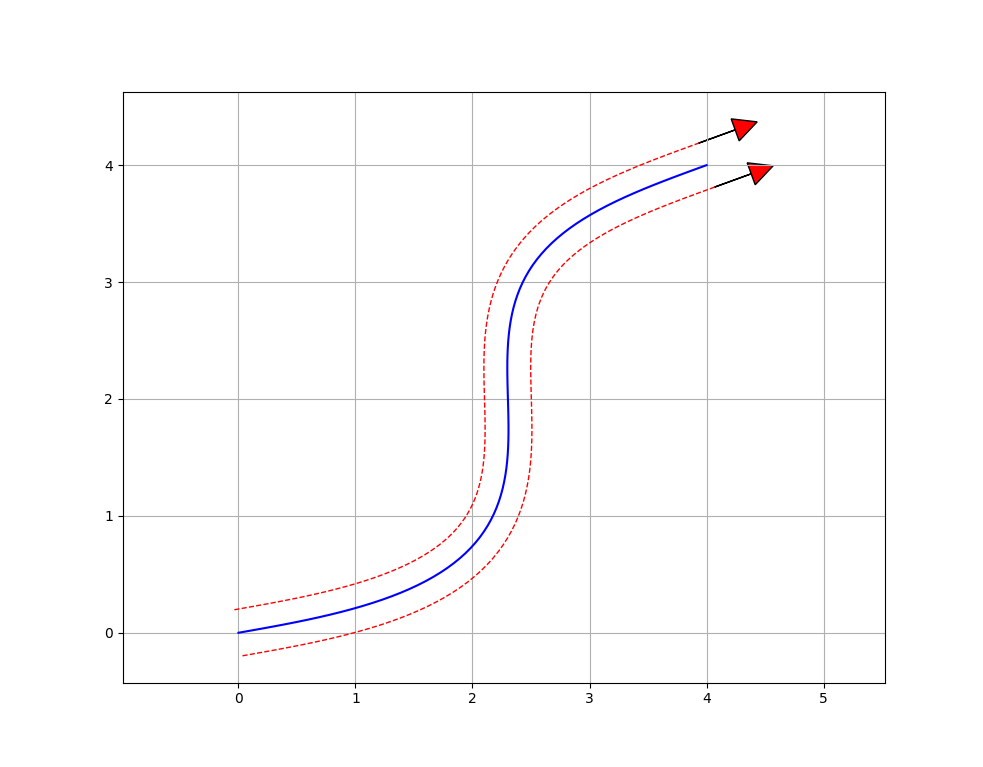
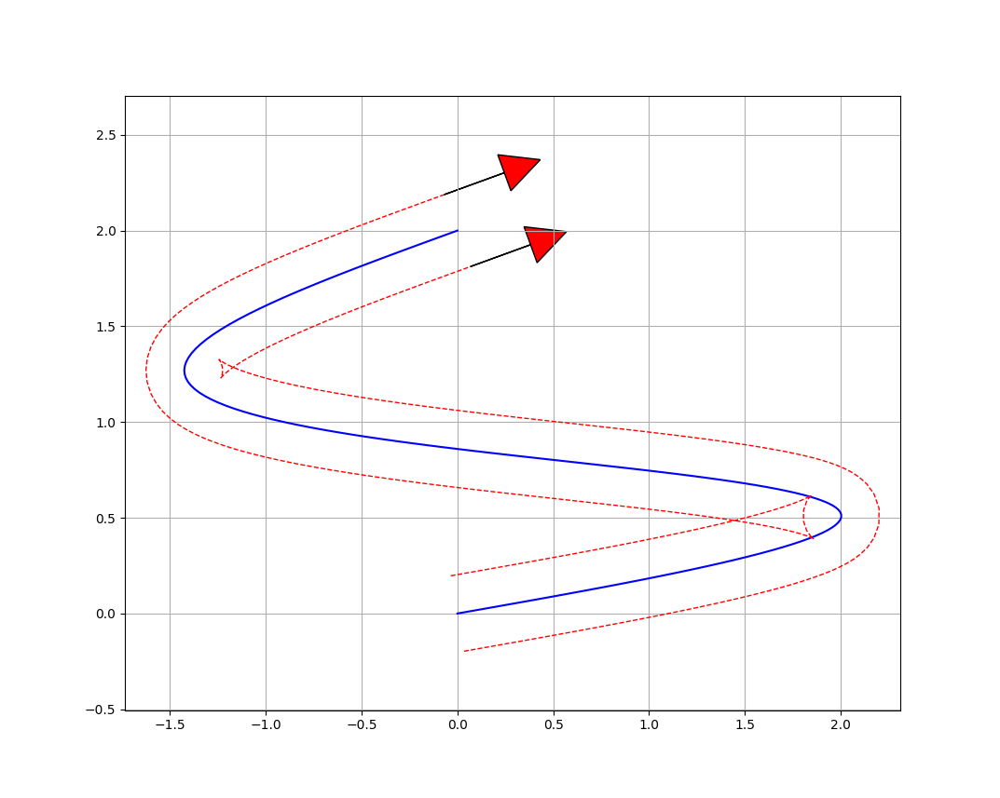

<div style="text-align:center">
<p align="center">

</p>

<hr>

<p align="center">
   
</p>

</div>
A library for generating spline-based paths for robots.

The "squiggles" created by this path generation library allow for smooth, fast
autonomous movements. Robots can follow the generated paths through the use of
the wheel velocities calculated at each point _along with an appropriate feedback
controller_.

## Installation

The Squiggles source code contains no external dependencies. You can include
Squiggles in any existing project that uses C++20 standard by adding the
contents of the `include` and `src` directories to your project.

You can also add Squiggles to your project as a static library by downloading
[the latest release from Github](https://github.com/baylessj/robotsquiggles/releases).

For instructions on building the library in a development environment see
[CONTRIBUTING](https://github.com/baylessj/robotsquiggles/CONTRIBUTING.md).

## Example Path



The above path can be created in three simple steps. First, define the
`Constraints` with the robot's maximum velocity, acceleration, and jerk when
driving:

```cpp
#include "squiggles.hpp"

const double MAX_VEL = 2.0; // in meters per second
const double MAX_ACCEL = 3.0; // in meters per second per second
const double MAX_JERK = 6.0; // in meters per second per second per second
auto constraints = squiggles::Constraints(MAX_VEL, MAX_ACCEL, MAX_JERK);
```

Then measure the width between the robot's wheels and create a `SplineGenerator`
with the constraints and the width measurement:

```cpp
#include "squiggles.hpp"
const double MAX_VEL = 2.0;     // in meters per second
const double MAX_ACCEL = 3.0;   // in meters per second per second
const double MAX_JERK = 6.0;    // in meters per second per second per second
const double ROBOT_WIDTH = 0.4; // in meters
auto constraints = squiggles::Constraints(MAX_VEL, MAX_ACCEL, MAX_JERK);
auto generator = squiggles::SplineGenerator(
  constraints,
  std::make_shared<squiggles::TankModel>(ROBOT_WIDTH, constraints));
```

And finally specify a starting point for the robot (probably `0, 0, 0`) and a
goal point to drive to:

```cpp
#include "squiggles.hpp"
const double MAX_VEL = 2.0;     // in meters per second
const double MAX_ACCEL = 3.0;   // in meters per second per second
const double MAX_JERK = 6.0;    // in meters per second per second per second
const double ROBOT_WIDTH = 0.4; // in meters
auto constraints = squiggles::Constraints(MAX_VEL, MAX_ACCEL, MAX_JERK);
auto generator = squiggles::SplineGenerator(
  constraints,
  std::make_shared<squiggles::TankModel>(ROBOT_WIDTH, constraints));

auto path = generator.generate({Pose(0, 0, 0), Pose(2, 2, 0)});
```

## Motion Profiles


The robot's `Constraints` provide the maximum allowable dynamics for the
generated paths. Careful measurement and configuration of these parameters ensures
that the path will not expect the robot to move more quickly than it actually
can. Resolving such discrepancies in the generated path and reality is an important
first step in ensuring that the robot performs reliably.

### Feedback Control

While these motion profiles help the robot's path-following abilities considerably
they are far from a guarantee that the robot will exactly follow the generated
path. It is recommended to pair the output of Squiggles with a feedback controller.
A [velocity PID controller](https://okapilib.github.io/OkapiLib/classokapi_1_1AsyncVelPIDController.html)
is an easy start but a controller optimized for path following such as the
[Pure Pursuit Controller](https://www.ri.cmu.edu/pub_files/pub3/coulter_r_craig_1992_1/coulter_r_craig_1992_1.pdf)
or [Ramsete Controller](https://docs.wpilib.org/en/stable/docs/software/advanced-control/trajectories/ramsete.html)
is the best choice.

## Physical Models

Currently only "tank drive" or "differential drive" robots are supported, as
shown below.



## License

Use of this source code is governed by an MIT-style license that can be found in
the LICENSE file or at [opensource.org](https://opensource.org/licenses/MIT).

## Acknowledgments

This code was influenced by libraries and knowledge from the following sources:

- [Team 254 and the WPILib Team](https://github.com/wpilibsuite/allwpilib)
- [Jaci Brunning](https://github.com/JaciBrunning/Pathfinder)
- [Atsushi Sakai](https://github.com/AtsushiSakai/PythonRobotics)
